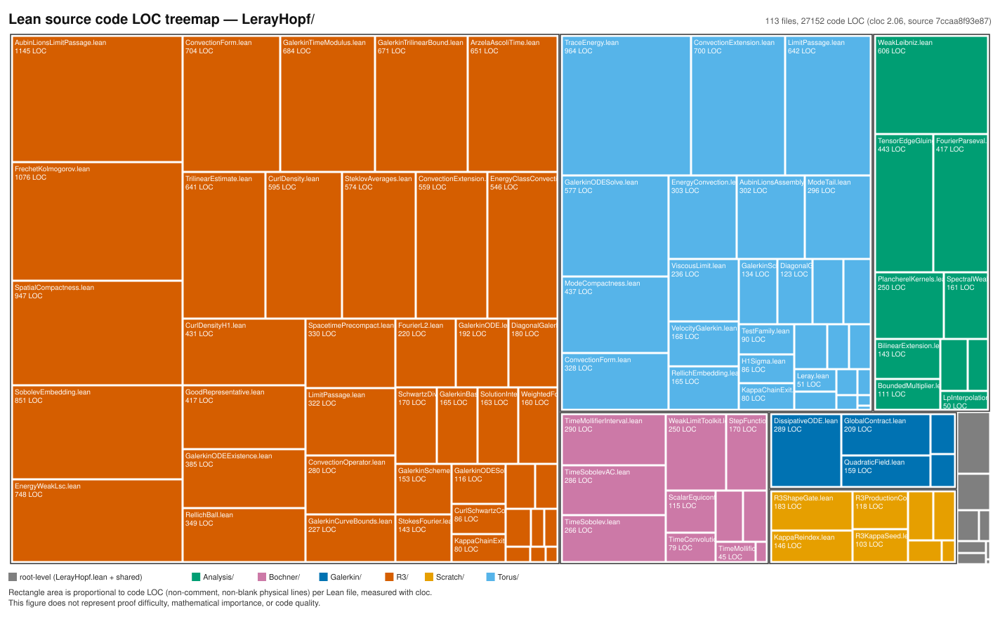

# Leray–Hopf weak existence in Lean

[](https://github.com/uda-lab/leray-hopf/actions/workflows/release-attestation.yml)

> The badge links to on-demand build attestations for individual commits, not a
> per-commit CI signal — see [`docs/build-and-checks.md`](docs/build-and-checks.md)
> for what it does and does not certify.

A Lean 4 + mathlib formalization of **Leray–Hopf weak existence** for the
incompressible Navier–Stokes equations, on the periodic 3-torus 𝕋³ and on whole
space ℝ³. Two capstone existence theorems are proved and machine-checked, and both
are **kernel-only**: `#print axioms` returns only the standard kernel axioms
(`propext`, `Classical.choice`, `Quot.sound`), with zero project axioms and no
`sorryAx`. This repository does **not** claim smoothness or higher regularity
beyond the stated energy-class properties, nor uniqueness or non-uniqueness of the
solutions it constructs.

**Start here:** [**uda-lab.github.io/leray-hopf-notes**](https://uda-lab.github.io/leray-hopf-notes/)
is an interactive, browsable companion to this repository — it presents the Lean
declarations, their dependency graph, Japanese-language mathematical exposition, and
per-declaration proof status.

## Explore the formalization

- **Interactive notes (Japanese exposition):** <https://uda-lab.github.io/leray-hopf-notes/>
- **Lean source:** [`LerayHopf/`](LerayHopf/)
- **Architecture / module map:** [`docs/architecture.md`](docs/architecture.md)
- **Exact claims and scope:** [`docs/claims-and-scope.md`](docs/claims-and-scope.md)
- **Citation:** [`CITATION.cff`](CITATION.cff)

## Main results

```lean
-- LerayHopf/Torus/GalerkinODECapstone.lean   (𝕋³)
theorem exists_lerayHopf_torus3 (u₀ : L2Sigma) (ν : ℝ) (hν : 0 < ν)
    (T : ℝ) (hT : 0 < T) :
    ∃ F : Torus3NSForms, Nonempty (LerayHopfSolutionFull F ν T u₀)

-- LerayHopf/R3/GalerkinODECapstone.lean      (ℝ³)
theorem exists_lerayHopf_r3 (u₀ : L2Sigma_R3) (ν : ℝ) (hν : 0 < ν)
    (T : ℝ) (hT : 0 < T) :
    ∃ (𝔊 : R3GalerkinScheme) (F : R3NSForms 𝔊),
      Nonempty (LerayHopfSolutionFull_R3 𝔊 F ν T u₀)
```

For any divergence-free initial data `u₀` in `L²`, viscosity `ν > 0`, and time
horizon `T > 0`, a Leray–Hopf weak solution exists on `𝕋³` (unit-period torus) and
on `ℝ³` alike — each proof-carrying, with the divergence-free property, the weak
Navier–Stokes identity, the energy inequality, and the initial-value trace all
exposed as fields of the returned solution structure, not just asserted in prose.

The precise field-by-field statement of what each part of the solution structure
guarantees — and, just as importantly, what it does not — is
[`docs/claims-and-scope.md`](docs/claims-and-scope.md).

## Scope and limitations

- **No external force** — the homogeneous Navier–Stokes equation only.
- **Finite time horizon `[0, T]`** for an arbitrary given `T > 0`, not a single
  solution simultaneously valid on `[0, ∞)`.
- **𝕋³ is the unit torus** (period 1 in each coordinate), with no periodicity
  assumption on ℝ³.
- **Separated-variable weak formulation**: test functions are `ψ(t)·w(x)`, not a
  general space-time test function.
- **No smoothness or higher regularity beyond the stated energy-class
  properties** (a.e.-in-time H¹ membership plus integrable viscous dissipation);
  **uniqueness and non-uniqueness are not claimed.**
- **`LerayHopf.Experimental`** isolates incomplete, opt-in additional work; it is not
  reachable from the release surface below and not needed by either capstone.

See [`docs/claims-and-scope.md`](docs/claims-and-scope.md) for the exact, field-level
version of every bullet above.

## Verification status

- `import LerayHopf` is the release surface: it is `sorry`-free and project-axiom-free,
  enforced in CI (`scripts/check-release-cone.sh`).
- Build/toolchain-exact verification of a specific release-candidate commit is done by
  manual attestation (the badge above); see
  [`docs/build-and-checks.md`](docs/build-and-checks.md).
- The badge itself does not expire, but the workflow artifact and run log behind it are
  retention-limited. Durable copies of that evidence are stored as
  [Release assets](https://github.com/uda-lab/leray-hopf/releases) (e.g.
  [`v0.1.0-rc1`](https://github.com/uda-lab/leray-hopf/releases/tag/v0.1.0-rc1)), which
  certify one exact SHA and are not subject to that Actions retention deadline — see
  "Durability caveat" in
  [`docs/build-and-checks.md`](docs/build-and-checks.md#durability-caveat).
- Incomplete additional work is isolated behind the explicit opt-in
  `import LerayHopf.Experimental`, never pulled in by `import LerayHopf`.

## Getting started

```lean
import LerayHopf
```

```bash
lake build
```

For the full import matrix (which import brings in what, and its exact
sorry/axiom status), the CI policy, and how to reproduce a release attestation, see
[`docs/build-and-checks.md`](docs/build-and-checks.md) and
[`docs/claims-and-scope.md`](docs/claims-and-scope.md).

## Repository map

The area of each rectangle is proportional to the number of non-comment,
non-blank lines (code LOC) in the corresponding Lean source file, covering
[`LerayHopf.lean`](LerayHopf.lean) and every file under [`LerayHopf/`](LerayHopf/);
color marks the top-level module a file belongs to.

[](docs/assets/code-loc-treemap.svg)

See [`docs/architecture.md`](docs/architecture.md#visual-overview-code-loc-treemap)
for the full-size figure, the measurement method, and how to regenerate it.

## Star History

<a href="https://www.star-history.com/?repos=uda-lab/leray-hopf&amp;type=date&amp;legend=top-left">
 <picture>
   <source media="(prefers-color-scheme: dark)" srcset="https://api.star-history.com/chart?repos=uda-lab/leray-hopf&amp;type=date&amp;theme=dark&amp;legend=top-left&amp;sealed_token=seblTJCpa7k-WwWrbWgEIEcfB7J8ZiCwjxREO4qohU0rD65saqGYQJIVkXGjXTtu7E6rBeWSoLwCjFiCdMLs1XiPeYYnIjDcsUpyvM9KXZSjIxqCX5D5jngEDa25wroBaFIgnv8hY75VJLwU-swtQAnAvrGMmjYKIlJW0wOBpLuSRw6Aa1--x4mqRdoG" />
   <source media="(prefers-color-scheme: light)" srcset="https://api.star-history.com/chart?repos=uda-lab/leray-hopf&amp;type=date&amp;legend=top-left&amp;sealed_token=seblTJCpa7k-WwWrbWgEIEcfB7J8ZiCwjxREO4qohU0rD65saqGYQJIVkXGjXTtu7E6rBeWSoLwCjFiCdMLs1XiPeYYnIjDcsUpyvM9KXZSjIxqCX5D5jngEDa25wroBaFIgnv8hY75VJLwU-swtQAnAvrGMmjYKIlJW0wOBpLuSRw6Aa1--x4mqRdoG" />
   
 </picture>
</a>

## Documentation, contributing, citation, license

- [`docs/architecture.md`](docs/architecture.md) — module map.
- [`docs/claims-and-scope.md`](docs/claims-and-scope.md) — exact claims table and
  import guide.
- [`docs/STATUS.md`](docs/STATUS.md) — axiom/`sorry` ledger and integrity backstop.
- [`docs/build-and-checks.md`](docs/build-and-checks.md) — build, discipline checks,
  CI policy, and the Star History embed's token-rotation runbook.
- [`CONTRIBUTING.md`](CONTRIBUTING.md) — build-cost policy, statement-changing PR
  review requirement, and issue/PR conventions.
- [`SECURITY.md`](SECURITY.md) — soundness issues, guard bypasses, and supply-chain
  concerns.
- [`CITATION.cff`](CITATION.cff) — citation metadata; cite via GitHub's "Cite this
  repository" or this file directly.
- [`LICENSE`](LICENSE) — Apache License 2.0. Copyright 2026 Tomoki Uda. The license
  covers the Lean formalization code and repository materials; it does not purport to
  license mathematical facts or theorems themselves.
